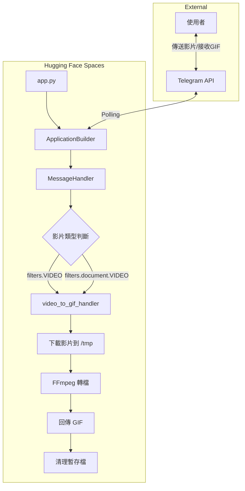

# Design Document

## Overview

本設計文件描述 Telegram Bot 影片轉 GIF 服務的技術架構。Bot 部署於 Hugging Face Spaces (Free CPU Basic)，使用 `python-telegram-bot` v20+ 非同步框架接收使用者影片，透過 FFmpeg 轉換為 GIF 後回傳。

設計重點：
- 非同步處理以提升響應性
- 優化 FFmpeg 參數以適應免費 CPU 限制
- 完善的錯誤處理與資源清理機制

## Architecture



## Components and Interfaces

### 1. 主程式入口 (app.py)

**職責**: 初始化 Bot、註冊 Handler、啟動 Polling

```python
# 介面定義
async def main() -> None:
    """初始化並啟動 Bot"""
    pass

async def video_to_gif_handler(update: Update, context: ContextTypes.DEFAULT_TYPE) -> None:
    """處理影片訊息的主要 Handler"""
    pass
```

### 2. 影片處理模組

**職責**: 下載影片、執行轉檔、回傳結果

```python
async def download_video(file: File, file_path: str) -> bool:
    """下載影片到指定路徑"""
    pass

def convert_to_gif(input_path: str, output_path: str) -> bool:
    """使用 FFmpeg 將影片轉換為 GIF"""
    pass

def cleanup_files(*file_paths: str) -> None:
    """清理暫存檔案"""
    pass
```

### 3. 配置檔案

| 檔案 | 用途 |
|------|------|
| `packages.txt` | HF Spaces 系統依賴 (ffmpeg) |
| `requirements.txt` | Python 套件依賴 |
| `app.py` | 主程式 |

## Data Models

### 處理流程狀態

```python
@dataclass
class ConversionJob:
    user_id: int           # Telegram 使用者 ID
    chat_id: int           # 聊天室 ID
    input_path: str        # 輸入影片路徑
    output_path: str       # 輸出 GIF 路徑
    status: str            # pending | processing | completed | failed
    error_message: str     # 錯誤訊息 (如有)
```

### FFmpeg 轉檔參數

```python
FFMPEG_PARAMS = {
    "fps_options": [20, 15, 10],  # 漸進式 FPS 選項 (優先高畫質)
    "max_size_mb": 20,            # 最大檔案大小限制 (MB)
}
```

### 漸進式轉檔策略

```python
def convert_to_gif_with_retry(input_path: str, output_path: str, max_size_mb: int = 20) -> bool:
    """
    漸進式轉檔策略：
    1. 嘗試 20 FPS (最佳畫質)
    2. 若超過 20MB，降至 15 FPS
    3. 若仍超過，降至 10 FPS
    4. 若仍失敗，回報錯誤
    """
    pass
```

## Correctness Properties

*A property is a characteristic or behavior that should hold true across all valid executions of a system-essentially, a formal statement about what the system should do. Properties serve as the bridge between human-readable specifications and machine-verifiable correctness guarantees.*

### Property 1: 唯一檔名生成

*For any* 兩個不同的處理請求 (不同 user_id 或不同時間戳)，生成的暫存檔名應該互不相同，避免檔案衝突。

**Validates: Requirements 3.2**

### Property 2: GIF 檔案大小限制

*For any* 輸入影片，經過漸進式轉檔後的 GIF 檔案大小應該不超過 20MB (或在所有 FPS 選項都嘗試後回報失敗)。

**Validates: Requirements 4.4, 4.5**

### Property 3: 暫存檔清理保證

*For any* 處理流程 (無論成功或失敗)，流程結束後該次處理產生的所有暫存檔案都應該被刪除。

**Validates: Requirements 5.3, 6.1**

## Error Handling

### 錯誤類型與處理策略

| 錯誤情境 | 處理方式 | 使用者訊息 |
|---------|---------|-----------|
| Token 未設定 | 程式終止並記錄錯誤 | (無法啟動) |
| 影片下載失敗 | 記錄錯誤、清理、回傳訊息 | "❌ 影片下載失敗，請重試" |
| FFmpeg 轉檔失敗 | 記錄錯誤、清理、回傳訊息 | "❌ 轉檔失敗，請確認影片格式" |
| GIF 檔案過大 (>20MB) | 清理、回傳訊息 | "❌ GIF 檔案超過 20MB 限制，請嘗試較短影片" |
| 未知錯誤 | 記錄完整 traceback、清理 | "❌ 發生未知錯誤，請稍後重試" |

### 錯誤處理流程

```python
async def video_to_gif_handler(update, context):
    input_path = None
    output_path = None
    try:
        # 1. 下載影片
        # 2. 轉檔
        # 3. 回傳 GIF
    except DownloadError:
        await update.message.reply_text("❌ 影片下載失敗，請重試")
    except ConversionError:
        await update.message.reply_text("❌ 轉檔失敗，請確認影片格式")
    except FileTooLargeError:
        await update.message.reply_text("❌ GIF 檔案過大，請嘗試較短影片")
    except Exception as e:
        logging.exception("未知錯誤")
        await update.message.reply_text("❌ 發生未知錯誤，請稍後重試")
    finally:
        cleanup_files(input_path, output_path)  # 確保清理
```

## Testing Strategy

### 測試框架

- **單元測試**: `pytest` + `pytest-asyncio`
- **Property-Based Testing**: `hypothesis`

### 單元測試範圍

1. **檔名生成函式**: 驗證格式正確、包含 user_id 和時間戳
2. **FFmpeg 命令建構**: 驗證參數正確 (寬度、幀率)
3. **清理函式**: 驗證檔案刪除邏輯
4. **錯誤處理**: 模擬各種失敗情境

### Property-Based Testing 範圍

每個 property test 需執行至少 100 次迭代：

1. **Property 1 測試**: 生成大量隨機 user_id 和時間戳，驗證檔名唯一性
2. **Property 2 測試**: 驗證輸出 GIF 檔案大小不超過 20MB
3. **Property 3 測試**: 模擬成功/失敗流程，驗證暫存檔清理

### 測試標註格式

```python
# **Feature: video-to-gif-bot, Property 1: 唯一檔名生成**
@given(st.integers(), st.integers())
def test_unique_filename_generation(user_id1, user_id2):
    ...
```

